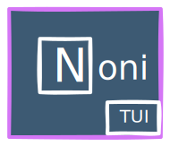

<h1 align="center">
   
  
   
  NoniTUI
   
</h1>

<h4 align="center">Session based project management tool made for Terminal using <a href="https://www.textualize.io/" target="_blank">Textualize</a>.</h4>

## Key Features

- Keyboard based navigation
- Share session with others using project UUID
- Create and join projects
- Manage tasks (CRUD)
- Chat with people in the same session
- Realtime collaboration between users in the same session

## Setup

Please see the <a href="/server/README.md">server</a> for setup instructions.
